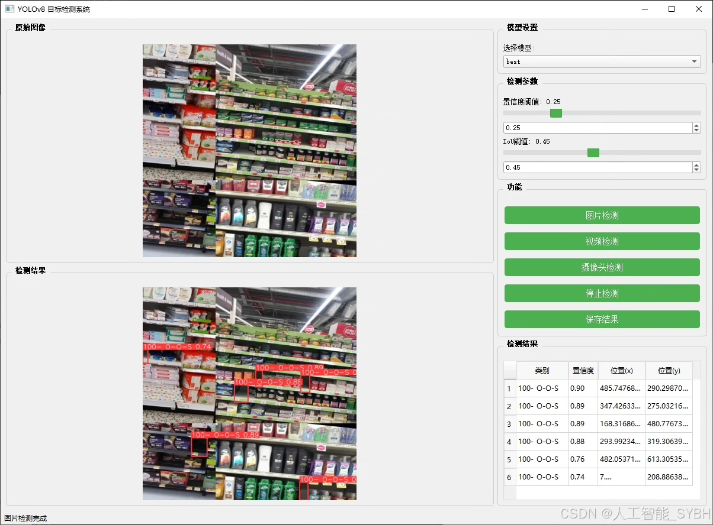
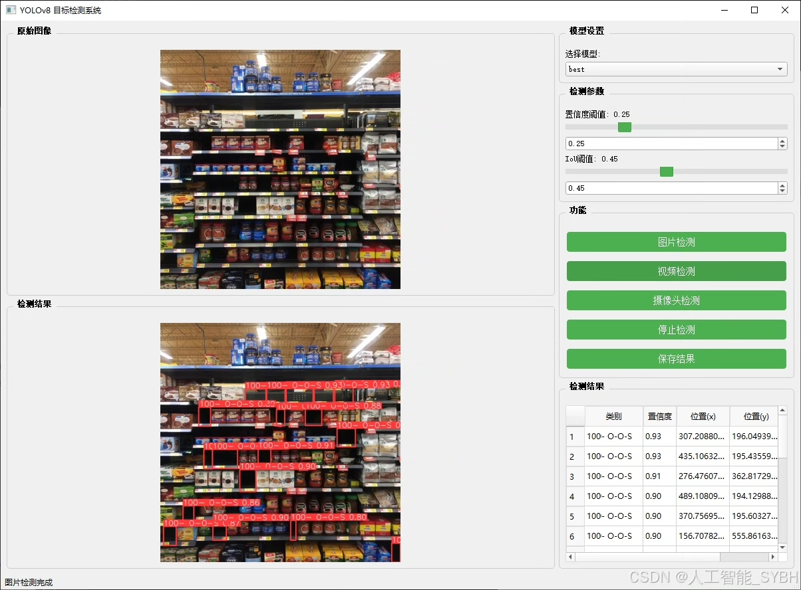
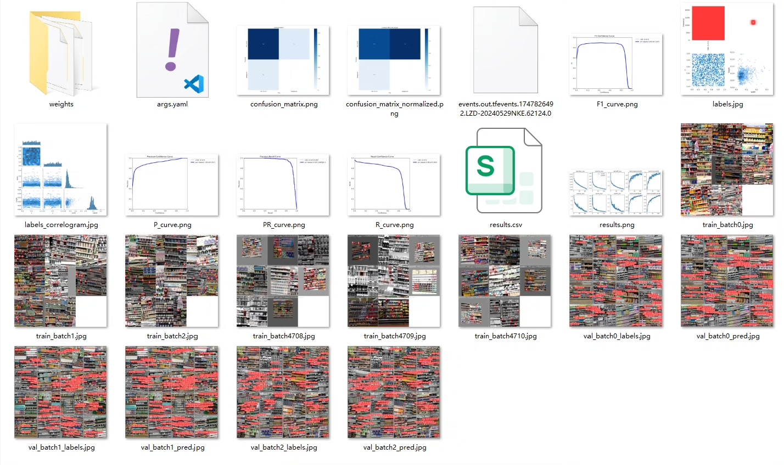
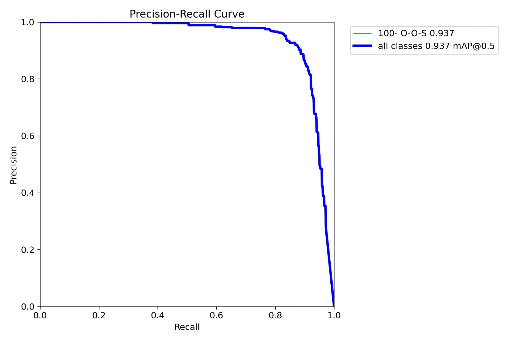
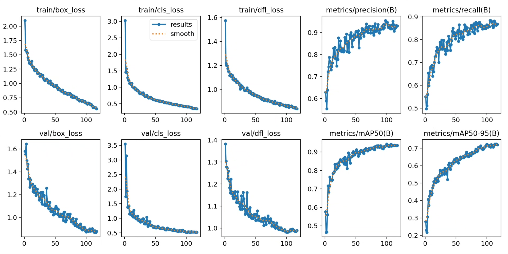
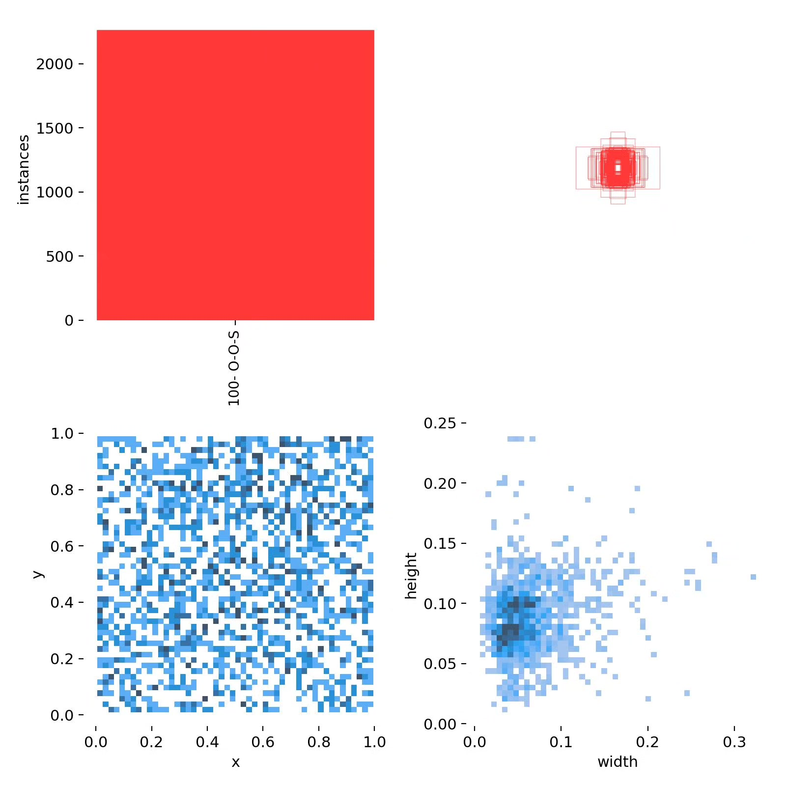
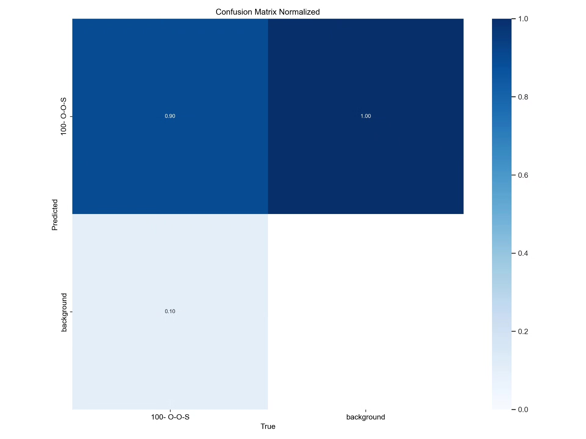
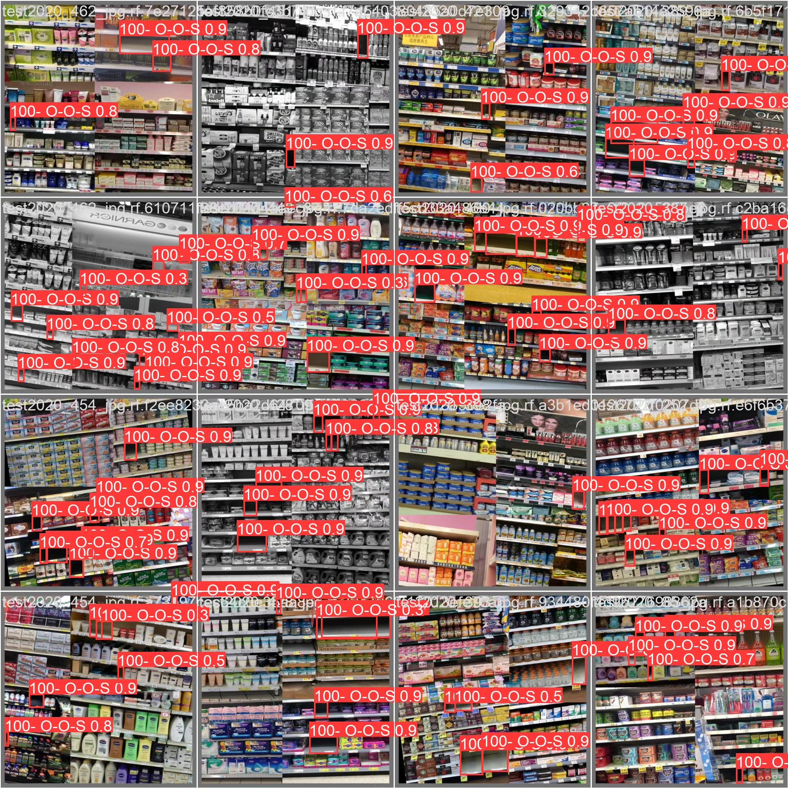

# Based on deep learning YOLOv8 for supermarket empty shelf detection system (YOLOv

## Body

This project has been developed based on the YOLOv8 object detection algorithm to create a smart inventory system for supermarket shelves, specifically designed to detect out-of-stock (OOS) items. The system uses the "100-O-O-S" as the only detection category, and through real-time analysis of shelf images, it can accurately identify and locate the OOS areas. The dataset used in the project has undergone data augmentation and model optimization, achieving high detection accuracy. This system can be integrated into the existing surveillance system of supermarkets, providing real-time data support for inventory management and restocking decisions, effectively improving retail operational efficiency.

The company's products have obtained the official commercial license certification from YOLO.

We provide after-sales service.

After payment, we will provide WeChat IDs for instant questions and answers.

Environment configuration: We will provide an instructional tutorial on environment setup, with WeChat available for Q&A.

Remote installation services: If you need remote configuration, an additional fee of 69 is required, with all fees refunded if the configuration fails (only refund installation fees for older computers).

Retraining the dataset: After setting up the environment, you can train on your own computer. If you need us to retrain, just pay 69 plus the computing power fee (2.5 yuan/hour).

Full after-sales service

## Images

## Payment

Here is a pay link on Stripe ( https://buy.stripe.com/3cs8yP7sY87d0vu9AB ). Please contact me lonlonago@foxmail.com after funding $89, and I will send you a complete data files , thank you!

